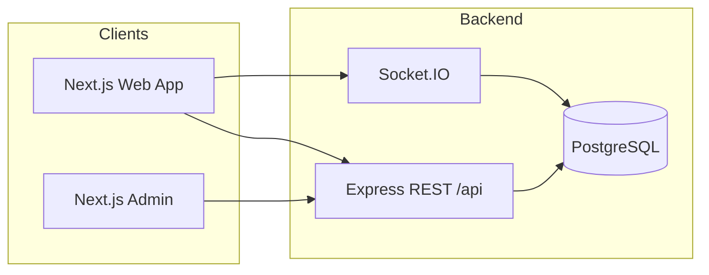

# GTN — Global Telecom Network

**GTN** is a full-stack telecom-style web platform: voice calls over WebRTC, real-time messaging, multi-party voice rooms, subscriptions and payments, referrals, and a separate admin console. This repository contains the **API server**, the **customer-facing web app**, and the **admin dashboard**.

---

## Live product & links

Replace the placeholders below with your real URLs when you publish the project.

| Resource | URL |
|----------|-----|
| **Public website / app** | `https://YOUR_DOMAIN` |
| **Marketing / landing** (if different) | `https://YOUR_DOMAIN` or `https://www.YOUR_DOMAIN` |
| **API (production)** | `https://api.YOUR_DOMAIN` (or your chosen API host) |
| **Admin dashboard (production)** | `https://admin.YOUR_DOMAIN` (optional) |
| **Status / docs** | Add your status page or public API docs URL if you have one |

> **Repository:** `https://github.com/YOUR_ORG/YOUR_REPO` — update this line to your GitHub path.

---

## What GTN does

- **Accounts:** Email-based sign-up and login, JWT authentication, optional **TOTP two-factor authentication (2FA)** with backup codes, password change, account deletion, and “log out all devices” (token version + session revocation).
- **Sessions:** Server-side **user sessions** (device/session list; per-session revoke) tied to JWT `jti` where enabled.
- **Voice (P2P):** Browser **WebRTC** calls between users (simple-peer + Socket.IO signaling), with call start/end and usage aligned to plans and free minutes.
- **Messaging:** Real-time **direct messages** (Socket.IO), read receipts, typing indicators, voice notes, conversation inbox, and contact discovery by phone / subscriber ID.
- **Voice rooms:** **Multi-user voice rooms** with WebRTC mesh signaling, optional room chat, reactions, and billing hooks for speaking time.
- **Plans & billing:** **Plans** (e.g. free, time-bound unlimited tiers), **subscriptions**, and **payments** (multiple provider patterns in schema: mobile money, card/Stripe, etc. — wire your PSPs in deployment).
- **Referrals:** Referral program with clicks, signup attribution, and rewards tied to activity (implementation details in `backend/modules/referrals`).
- **User preferences:** Rich JSON **preferences** (chat, voice, rooms, security, notifications, appearance, data saver, etc.) synced from the client.
- **Safety / social:** **User blocks** (either direction blocks DMs, calls, and room joins per policy).
- **Locale:** Server helpers for region/currency from phone/locale routes.
- **Admin:** Separate **Next.js** admin app with authenticated admin APIs (users, audit, RBAC patterns — see `backend/modules/admin`).

---

## High-level architecture



- **REST** under `/api` (users, auth, calls, messages, voice rooms, plans, payments, referrals, WebRTC ICE config, etc.).
- **Socket.IO** for chat, call signaling, voice room signaling, and related events.
- **PostgreSQL** with **Prisma** as the ORM and migration source of truth.

---

## Repository layout

```
gtn/
├── backend/          # Node.js API + Socket.IO + Prisma
│   ├── prisma/       # schema, migrations, seed
│   ├── modules/      # domain modules (auth, users, calls, messages, …)
│   ├── socket/       # Socket.IO handlers
│   └── server.js     # HTTP + Socket entry
├── frontend/         # Next.js customer app (React 19, Tailwind)
├── admin/            # Next.js admin dashboard (port 3001 in dev)
├── .gitignore        # Monorepo-wide ignore rules
└── README.md         # This file
```

---

## Tech stack

| Layer | Technology |
|-------|------------|
| **API** | Node.js, Express 5, Prisma, Socket.IO, Zod, bcrypt, JWT, otplib (TOTP) |
| **Database** | PostgreSQL |
| **Web & admin** | Next.js 16, React 19, Tailwind CSS |
| **Realtime / voice** | Socket.IO client, simple-peer (WebRTC) |
| **Payments** | Stripe (and extensible patterns for other providers) |

Exact versions are pinned in each package’s `package.json`.

---

## Prerequisites

- **Node.js** 20+ (or the LTS version you standardize on; Node 22 is commonly used in dev).
- **PostgreSQL** 14+ accessible via `DATABASE_URL`.
- **npm** (or pnpm/yarn if you adapt the commands).

Optional:

- **Stripe** (and/or other PSP) keys for payments.
- **SMTP** or transactional email if you enable email flows.
- **TURN** servers for WebRTC in restrictive NATs (`NEXT_PUBLIC_ICE_SERVERS_JSON` / server-side ICE config).

---

## Environment variables (overview)

**Never commit real `.env` files.** Copy from `.env.example` if you add one, or document locally. Typical variables include:

### Backend (`backend/.env`)

| Variable | Purpose |
|----------|---------|
| `DATABASE_URL` | PostgreSQL connection string |
| `JWT_SECRET` | Signing secret for user JWTs |
| `PORT` | HTTP port (often `5000`) |
| `SUBSCRIBER_ID_START` | Optional starting GTN subscriber number |
| `DAILY_FREE_MINUTES` | Optional daily free minutes grant |
| `STRIPE_*` / payment keys | As used by your payment module |
| `ICE_SERVERS_JSON` | Optional STUN/TURN JSON for server-fetched ICE |
| `ADMIN_APP_ORIGINS` | CORS for `/api/admin` |
| `NEXT_PUBLIC_*` | Not read by backend; listed here only if you share one file — keep API secrets server-side only |

### Frontend (`frontend/.env.local`)

| Variable | Purpose |
|----------|---------|
| `NEXT_PUBLIC_API_URL` | API base URL, e.g. `http://localhost:5000/api` |

### Admin (`admin/.env.local`)

| Variable | Purpose |
|----------|---------|
| `NEXT_PUBLIC_API_URL` | Same API base, or a dedicated admin API URL if split |

See each app’s code and deployment notes for the full list.

---

## Local development

### 1. Clone and install

```bash
git clone https://github.com/YOUR_ORG/YOUR_REPO.git
cd YOUR_REPO
```

Install dependencies in each project:

```bash
cd backend && npm install && cd ..
cd frontend && npm install && cd ..
cd admin && npm install && cd ..
```

### 2. Database

Create a database and set `DATABASE_URL` in `backend/.env`.

```bash
cd backend
npx prisma generate
npx prisma migrate deploy
# Optional:
# npx prisma db seed
```

### 3. Run the backend

```bash
cd backend
npm run dev
```

Default: **http://localhost:5000** — health check at `GET /`.

### 4. Run the web app

```bash
cd frontend
npm run dev
```

Default: **http://localhost:3000**

### 5. Run the admin app

```bash
cd admin
npm run dev
```

Default: **http://localhost:3001** (see `admin/package.json` scripts).

Ensure `NEXT_PUBLIC_API_URL` points at your API (including `/api` as used by the frontend wrapper).

---

## Production deployment (checklist)

1. Set strong `JWT_SECRET`, production `DATABASE_URL`, and all payment/provider secrets.
2. Run `npx prisma migrate deploy` on the production database.
3. Build and run: `npm run build` + `npm start` for Next apps; `npm start` (or process manager) for the backend.
4. Configure **HTTPS**, **CORS**, and **trusted proxy** headers if the API sits behind nginx/Cloudflare.
5. Provide **ICE** (STUN/TURN) for reliable WebRTC in the field.
6. Restrict **admin** origins via `ADMIN_APP_ORIGINS` and keep admin credentials separate from customer accounts.

---

## Security & privacy

- Passwords are stored **hashed** (bcrypt).
- **JWT + optional server-side sessions** support revocation and “log out everywhere.”
- **2FA** is available for accounts that enable it.
- Do **not** commit secrets, real phone numbers, or production database dumps.
- Review block lists, referral anti-abuse, and rate limits for your threat model before a public launch.

---

## Admin CLI helpers (backend)

From `backend/`:

| Script | Purpose |
|--------|---------|
| `npm run admin:create-user` | Bootstrap admin user (see script instructions) |
| `npm run admin:reset-password` | Reset admin password |
| `npm run admin:list-users` | List admin users |

---

## Further documentation (in-repo)

| Document | Description |
|----------|-------------|
| [`backend/docs/CALLS_P2P.md`](backend/docs/CALLS_P2P.md) | P2P voice calls / billing notes |
| [`backend/docs/VOICE_ROOMS.md`](backend/docs/VOICE_ROOMS.md) | Voice rooms (mesh, chat, billing) |
| [`backend/docs/GO_LIVE_ROLLOUT.md`](backend/docs/GO_LIVE_ROLLOUT.md) | Rollout / go-live checklist |
| [`backend/README.md`](backend/README.md) | Short backend index + session / referral reminders |

---

## Contributing

1. Fork the repository (once it is public) or use internal PRs.
2. Create a branch for your change.
3. Run linters/tests before opening a PR (`npm run lint` where available).
4. Describe API or schema changes in the PR body.

Replace this section with your governance (CLA, DCO, etc.) if needed.

---

## License

Specify your license here (e.g. **MIT**, **Apache-2.0**, or **proprietary**). Add a `LICENSE` file in the repo root to match.

---

## Contact & support

- **Website:** [YOUR_DOMAIN](https://YOUR_DOMAIN)
- **Issues:** Use GitHub Issues on this repository after publishing.
- **Email / support:** Add your public support address if you offer one.

---

